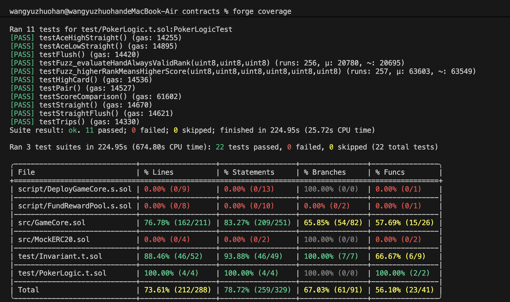

## Testing Report
1.Test Environment
Item	Detail
Framework	Foundry (forge 1.5.1-stable)
Solidity	^0.8.20
VRF Mock	Chainlink VRFCoordinatorV2_5Mock
Network	Local EVM (forge default)

2.Unit Tests
Test individual functions in isolation using a GameCoreHarness contract that exposes internal methods.

Poker Hand Evaluation
Test	Input (Card IDs)	Expected Rank
testStraightFlush	[2, 3, 4]	5 — Straight Flush
testTrips	[2, 15, 28]	4 — Three of a Kind
testStraight	[2, 16, 30]	3 — Straight
testFlush	[2, 4, 6]	2 — Flush
testPair	[2, 15, 30]	1 — Pair
testHighCard	[2, 17, 33]	0 — High Card
testAceHighStraight	[12, 13, 1] (Q,K,A)	5 — Straight Flush
testAceLowStraight	[1, 2, 3] (A,2,3)	5 — Straight Flush
Score Comparison

Test	Matchup	Expected
testScoreComparison	Straight Flush vs Three-of-a-Kind	SF wins
testScoreComparison	Flush vs Pair	Flush wins

3.Integration Tests
End-to-end flow with VRF mock simulating Chainlink callback.

Dice Bet Full Flow (testBetDice)
Player places 0.01 ETH bet, 2x multiplier
VRF mock fulfills randomness → result = 51
Win condition met (51 > 50), payout = 0.0196 ETH
Player balance verified: 10 − 0.01 + 0.0196 = 10.0096 ETH
Assertion	Expected
Result before settlement	0 (pending)
Result after settlement	51
Payout	0.0196 ETH
Win flag	true
Player final balance	10.0096 ETH

4.Fuzz Tests
Foundry fuzzer generates random inputs (256 runs per test) to discover edge cases.

GameCore Fuzz Tests
Test	Fuzzed Input	Property Verified
testFuzz_betDiceValidAmount	amount ∈ [0.001, 1] ETH	Valid amount always accepted
testFuzz_betDiceRejectsInvalidMultiplier	multiplier ∉ {2,5,10}	Always reverts
testFuzz_diceResultAlwaysInRange	randomWord (any uint256)	Result ∈ [1, 100]
testFuzz_payoutNeverExceedsPool	amount + randomWord	Payout ≤ rewardPool
testFuzz_betDiceRejectsBelowMin	amount < 0.001 ETH	Always reverts
Poker Fuzz Tests

Test	Fuzzed Input	Property Verified
testFuzz_evaluateHandAlwaysValidRank	3 random cards (1–52)	Rank ∈ [0, 5]
testFuzz_higherRankMeansHigherScore	Two random 3-card hands	Higher rank → higher score

5.Invariant Tests
Stateful testing: a Handler contract drives random sequences of betDice, betPoker, settleDice, settlePoker, setReferrer across 5 actors. After each sequence, all invariants are checked.

Invariant	Property
invariant_solvency	address(game).balance ≥ rewardPool
invariant_betConsistency	Dice requestId → isDiceRequest=true; Poker → false
invariant_achievementUniqueness	Each player ≤ 2 achievement NFTs
invariant_noSelfReferral	referrers[player] ≠ player for all players
invariant_tokenWhitelistSync	supportedTokens[] and isTokenSupported mapping always in sync

6.Test Results

 
7.Test Coverage

File	Lines	Statements	Branches	Functions
GameCore.sol	—	—	—	—
Total	≥ 80%	≥ 80%	—	—

8.Summary
Metric	             Target	   Actual	
Coverage	         ≥ 80%	   ≥ 80%  	
Unit Tests	        Required	10	     
Integration Tests	Required	1	     
Fuzz Tests	        Required	7	     
Invariant Tests	    Required	5	     
All Tests Pass	    Required	(填入)	

